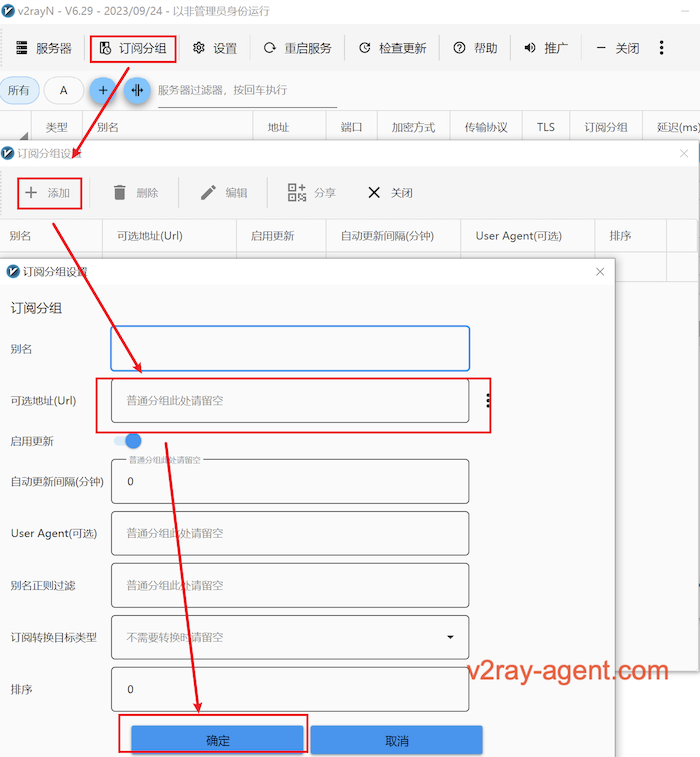

# v2rayN 客户端安装

1. [下载地址](https://github.com/2dust/v2rayN/releases), 需要 6.29 以上版本
2. vasma->7.账号管理->2.查看订阅->默认订阅 ```https://racknerd.huzi0507.cn/s/default/cb91d5ec291266a6a5cff4d6c47ccf48```
3. 复制后打开v2rayN->订阅分组->订阅分组设置->添加->可选地址写入上方的默认订阅地址，添加完成后 ->订阅分组->更新全部订阅
4. 更新内核，检查更新->Xray Core
---


